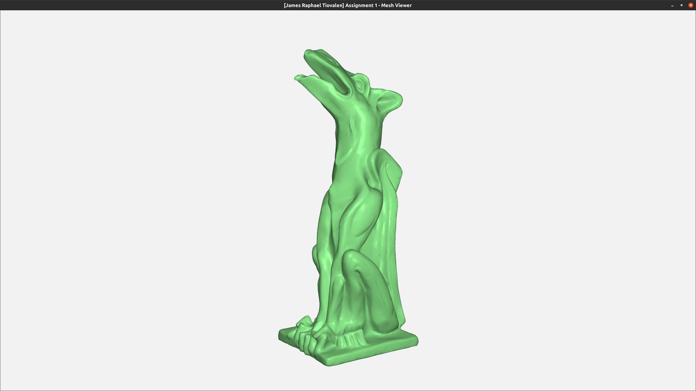
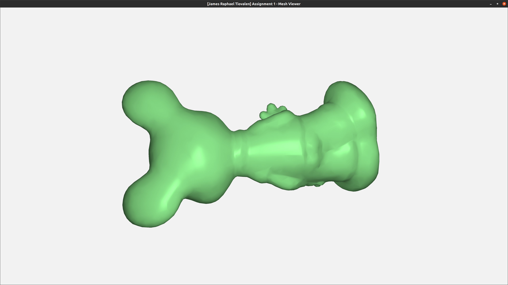
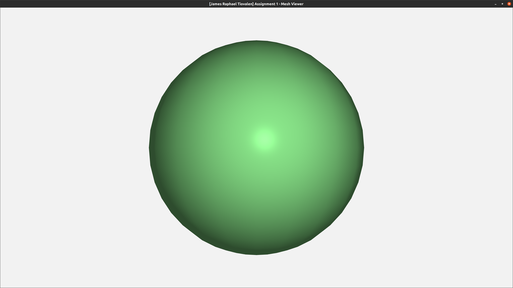
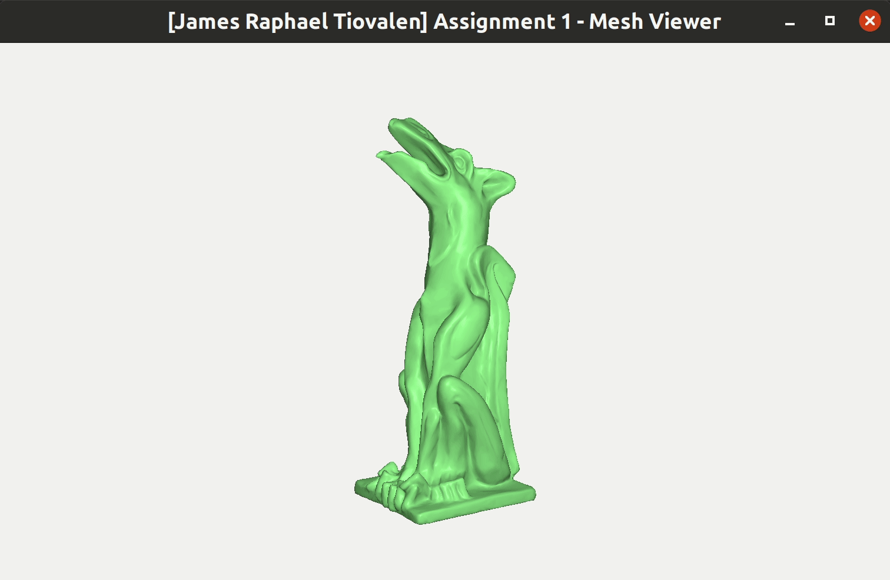
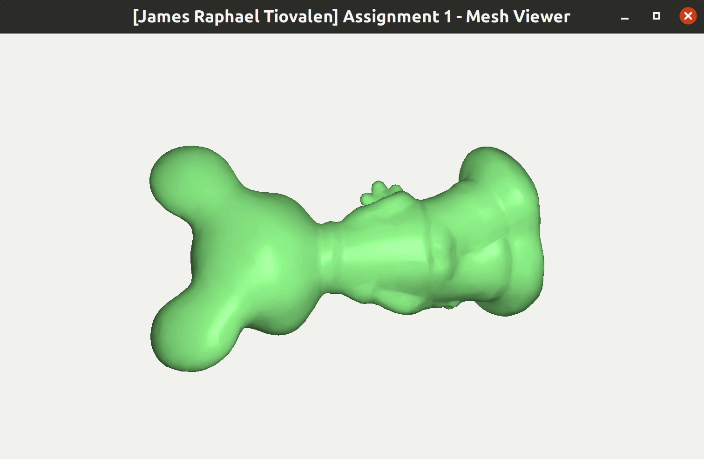
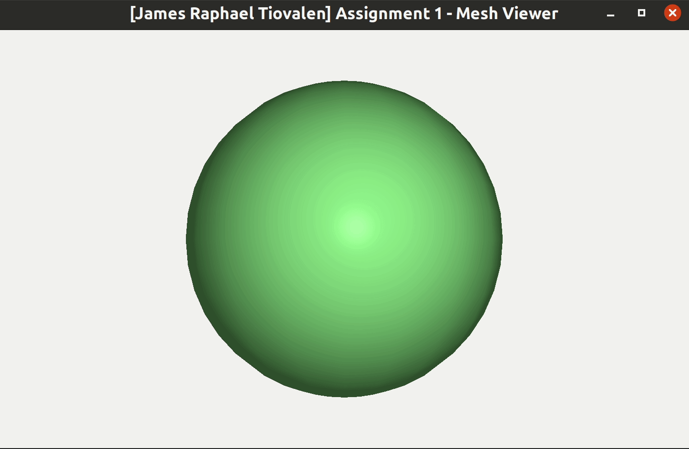

# Assignment 1

> James Raphael Tiovalen / 1004555


## Setup Instructions

To setup the environment, simply run the following commands:

```bash
cd Assignment_1_linux/
rm -r build/
mkdir build/
cd build/
cmake ..
```

Then, to execute the program, simply run the following commands from the `build` directory (where `filename` is the filename of the OBJ file of interest):

```bash
make
./Assignment_1 ../data/filename.obj
```


## Demo and Description of Features

The four features implemented in this assignment are:

- Mesh Loading
- Mesh Display/Rendering
- Mesh Coloring
- Mesh Transformation


### Mesh Loading

The program expects the filename of the OBJ file to be specified and passed in as command-line arguments when the `Assignment_1` binary executable is executed. The location specified for the OBJ file should be either in absolute path or relative to the location where the `Assignment_1` binary is located at.

The program would loop through each line in the OBJ file and parses them depending on the prefix specified in each line. This program only supports `v`, `vn` and `f` lines (not `vt`), as per the requirements stated in the corresponding Assignment 1 handout. The vertices would be assigned their corresponding indices depending on the order they are declared in the OBJ file (translating from the one-based indexing in the OBJ file specification to the zero-based indexing of C++ and OpenGL). The correspondence between the vertices and their normals is defined in the faces (i.e., `f` lines). The relevant information would then be passed into the `verList` and `triList` variables to be processed further by OpenGL.

After processing an OBJ file, the program would print some useful statistics: the number of vertices, normals, and faces stored in the OBJ file. In particular, the statistics for the 3 relevant demo OBJ files used for this assignment are:

- `garg.obj`:

  - 21278 vertices

  - 21278 normals

  - 42552 faces


- `mickey.obj`:

  - 3502 vertices

  - 3502 normals

  - 7000 faces


- `sphere.obj`:

  - 382 vertices

  - 382 normals

  - 760 faces


### Mesh Display/Rendering

The program utilizes the default shaders provided in the starter code for this assignment.


`garg.obj`:



`mickey.obj`:



`sphere.obj`:




### Mesh Coloring

Pressing the `C` button on the keyboard will change the color of the mesh currently being displayed. The program will cycle through 4 colors:

- Green
- Red
- Purple
- Yellow


`garg.obj`:



`mickey.obj`:



`sphere.obj`:




### Mesh Transformation

The three mesh transformations implemented in this program are:

- Rotation
- Translation
- Scaling

The implementation would multiply the corresponding transformation matrix with the inverse of the model matrix in order to perform the transformation relative to the model frame.


`garg.obj`:


`mickey.obj`:


`sphere.obj`:


