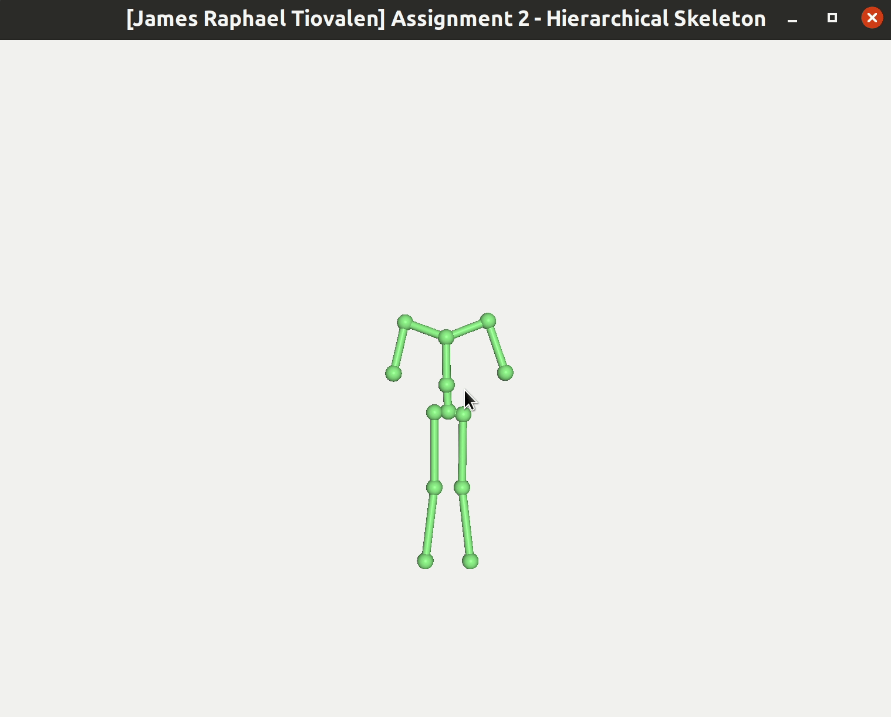
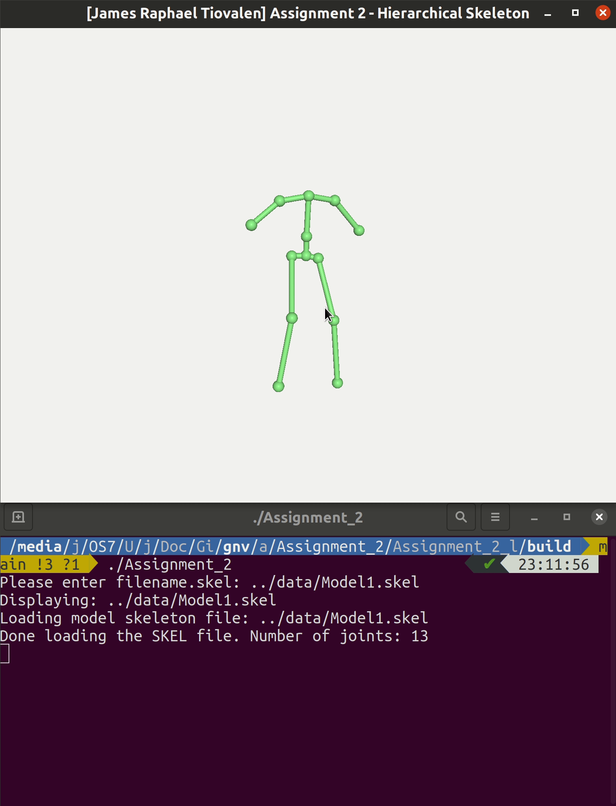
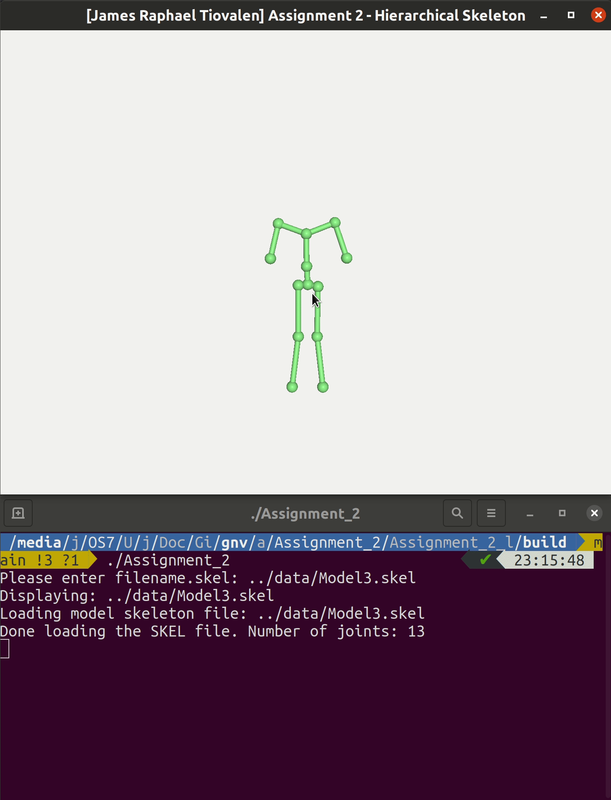
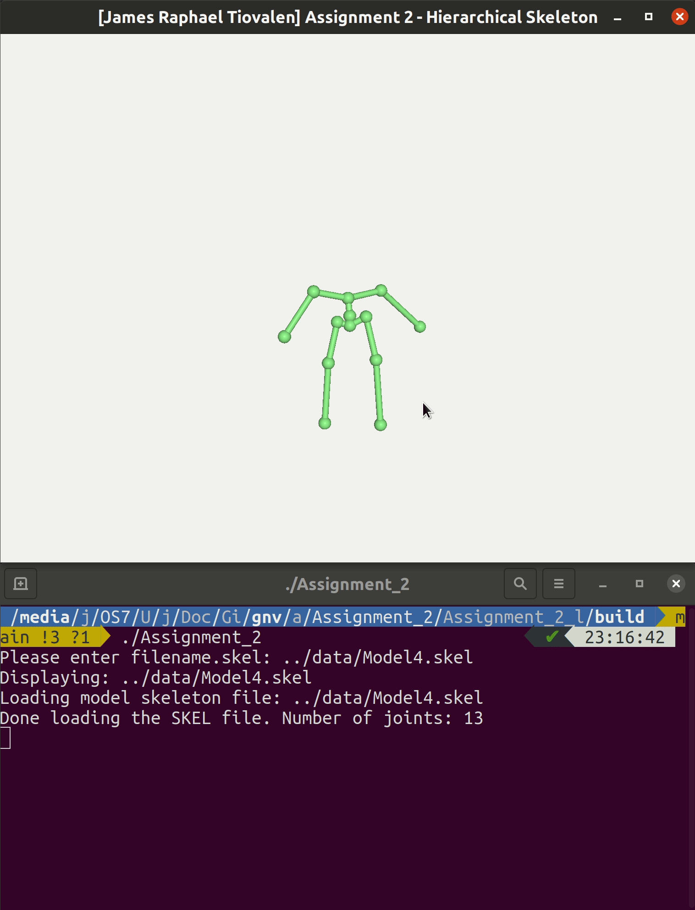

# Assignment 2

> James Raphael Tiovalen / 1004555

## Setup Instructions

To setup the environment, simply run the following commands:

```bash
cd Assignment_2_linux/
rm -r build/
mkdir build/
cd build/
cmake ..
```

Then, to execute the program, simply run the following commands from the `build` directory (where `filename` is the filename of the SKEL file of interest):

```bash
make
./Assignment_2
Please enter filename.skel: ../data/filename.skel
```

## Demo and Description of Features

The three features implemented in this assignment are:

- Load Skeleton File
- Draw Skeleton
- Change Pose of Skeleton

### Load Skeleton File and Draw Skeleton

All included skeleton files in the [data](./Assignment_2_linux/data/) directory contains 13 joints each.

`Model1.skel`:


`Model2.skel`:


`Model3.skel`:



`Model4.skel`:


### Change Pose of Skeleton

`Model1.skel`:



`Model2.skel`:


`Model3.skel`:



`Model4.skel`:



