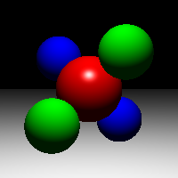
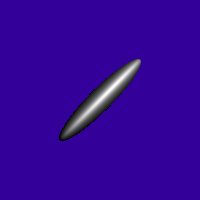

# Assignment 4

> James Raphael Tiovalen / 1004555

## Setup Instructions

To setup the environment, simply run the following commands:

```bash
cd Assignment_4_linux/
rm -r build/
mkdir build/
cd build/
cmake ..
```

Then, to execute the program, simply run the following commands from the `build` directory (where `scene_filename` is the filename of the scene file and `output_filename` is the output filename):

```bash
make
./Assignment_4 -input ../data/scene_filename.txt -size 200 200 -output ../image/output_filename.bmp
```

## Demo and Description of Features

The two ray tracing features implemented in this assignment are:

- Ray Intersection (Sphere, Plane, Triangle, Transform)
- Lighting Computations

### Scene 01: Plane



### Scene 02: Cube


### Scene 03: Sphere



### Scene 04: Axes


### Scene 05: Bunny


### Scene 06: Shine


