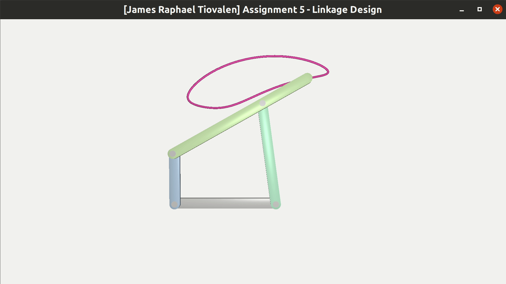
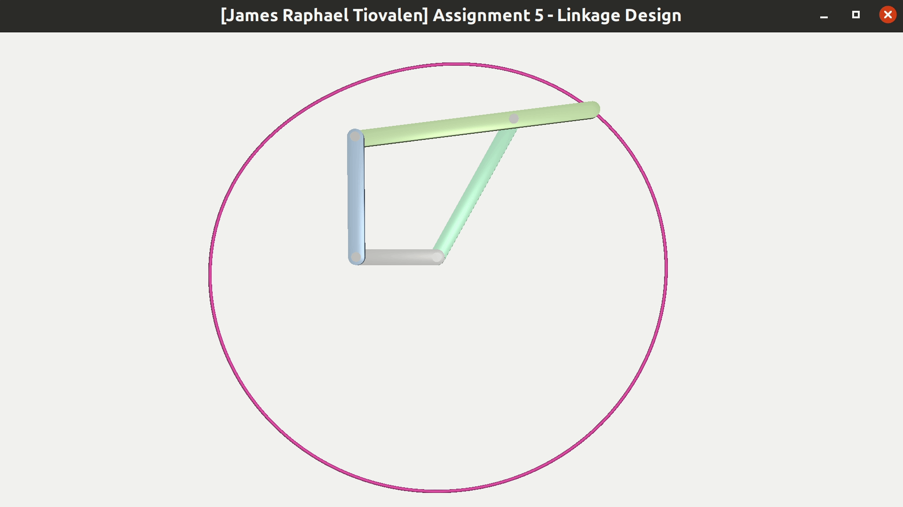
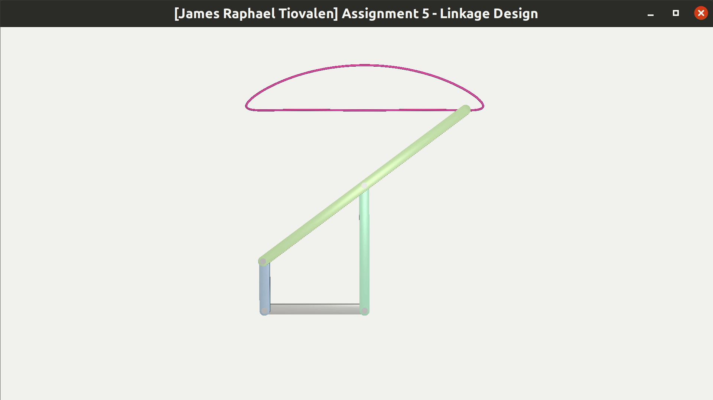
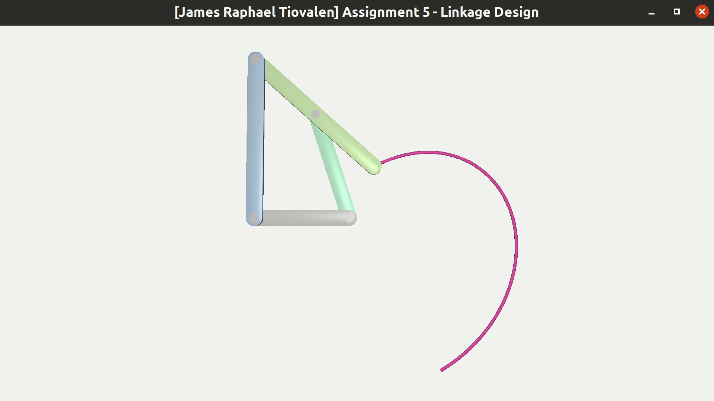

# Assignment 5

> James Raphael Tiovalen / 1004555

## Setup Instructions

To setup the environment, simply run the following commands:

```bash
cd Assignment_5_linux/
rm -r build/
mkdir build/
cd build/
cmake ..
```

Then, to execute the program, simply run the following commands from the `build` directory:

```bash
make
./Assignment_5
```

## Demo and Description of Features

All four different 4-bar linkages are implemented in this assignment:

1. Crank-Rocker
2. Drag-Link
3. Hoecken
4. Double-Rocker

### Crank-Rocker Linkage



### Drag-Link Mechanism



### Hoecken Linkage



### Double-Rocker Mechanism


